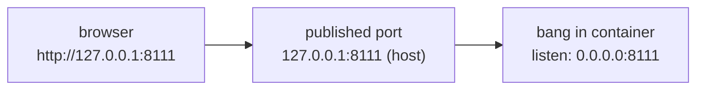

# Deployment

bang has to be running before the browser can use it, and it has to come back by
itself after a reboot or a crash — while it is the default search engine, a dead
resolver means a dead address bar. Pick one of the two supervisors below. Native
[launchd][launchd] is the better fit on macOS; the container is there for Linux
hosts and for keeping the binary off the host filesystem.

Either way, finish with [browsers.md][browsers] to register the resolver.

## Build

Toolchain and tasks are managed by [mise][mise]; `mise install` fetches
everything pinned in `mise.toml`.

```sh
mise install
mise run build     # -> bin/bang
```

`bin/` is gitignored. `mise run install` builds and copies the binary to
`~/.local/bin/bang`, and seeds `~/.config/bang/config.yaml` from the example if
there is not one already.

## Auto-start with launchd (macOS)

`com.taile.bang.plist` is a template with two placeholders, because a launchd
job gets no shell and cannot expand `$HOME` itself.

```sh
mise run install

sed -e "s|__HOME__|$HOME|g" -e "s|__CONFIG__|$HOME/.config/bang/config.yaml|" \
  com.taile.bang.plist > ~/Library/LaunchAgents/com.taile.bang.plist

launchctl bootstrap gui/$(id -u) ~/Library/LaunchAgents/com.taile.bang.plist
```

`RunAtLoad` starts it at login and `KeepAlive` restarts it if it exits, so no
crash leaves the address bar without a resolver.

Day-to-day commands:

```sh
launchctl print gui/$(id -u)/com.taile.bang      # status and last exit code
launchctl kickstart -k gui/$(id -u)/com.taile.bang  # restart after a rebuild
launchctl bootout gui/$(id -u)/com.taile.bang    # uninstall
tail -f ~/Library/Logs/bang.log                  # stdout and stderr
```

Rebuilding the binary does not restart the job. Run `kickstart -k` after
`mise run install`, or the old binary keeps serving.

Editing `~/.config/bang/config.yaml` needs no restart at all — the file is
watched and reloaded in place.

## Auto-start with Docker

The image is built by [ko][ko], which compiles the Go binary and assembles the
image layers directly. There is no Dockerfile to keep in sync with the build,
and the default base is [Chainguard's `static`][chainguard-static]: no shell, no
package manager, and a non-root default user.

```sh
mise run image     # -> ko.local/bang
```

A running Docker daemon is required, because the task loads the result straight
into it. The task also pins the platform to the host's, so the image does not
end up running under emulation.

### The listen address changes inside a container

This is the one thing that trips up a containerised run. Loopback inside the
container's network namespace is not the host's loopback, so the default
`listen: 127.0.0.1:8111` is unreachable from the browser. The container has to
bind all interfaces, and the _publish_ rule is what keeps the service private to
the machine.



So use a container-specific config with:

```yaml
listen: 0.0.0.0:8111
```

and publish it to host loopback only — `-p 127.0.0.1:8111:8111`. Dropping the
`127.0.0.1:` prefix would expose every query typed into the address bar to the
whole network.

The browser still reaches it as `127.0.0.1`, so the `Host` header stays a
loopback name and the resolver's own loopback check passes.

### Run it

```sh
docker run -d --name bang \
  --restart unless-stopped \
  -p 127.0.0.1:8111:8111 \
  -v "$HOME/.config/bang:/config:ro" \
  ko.local/bang -config /config/config.yaml
```

`--restart unless-stopped` is the container equivalent of `KeepAlive`: it
survives daemon restarts and reboots, and stays down only after an explicit
`docker stop`.

Mount the _directory_, not the file. The config watcher watches the parent
directory precisely because editors save by atomic rename, and a single-file
bind mount pins the original inode — the container would keep reading the file
that the editor replaced.

The default base image runs as UID 65532, so the config must be readable by
others: `chmod 644 ~/.config/bang/config.yaml`.

### Hot reload does not work on macOS or Windows

The watcher is [fsnotify][fsnotify], which needs `inotify` events. The
file-sharing layer that backs bind mounts on macOS and Windows does not forward
them, so saving the config changes nothing until you run `docker restart bang`.
On a Linux host, bind mounts propagate `inotify` normally and reload works as it
does natively.

This is the main reason to prefer launchd on macOS.

### Logs and status

```sh
docker logs -f bang
docker ps --filter name=bang
```

## Verify

Independent of how it is supervised, `/resolve` is a dry run — it reports where
a query would land instead of redirecting:

```sh
curl -s 'http://127.0.0.1:8111/resolve?q=p%21313'
```

A `403` means the `Host` header was not a loopback name; reach the service as
`127.0.0.1` or `localhost` rather than a LAN hostname. Connection refused means
the supervisor did not start it — check the logs above.

[browsers]: ./browsers.md
[chainguard-static]:
  https://images.chainguard.dev/directory/image/static/overview
[fsnotify]: https://github.com/fsnotify/fsnotify
[ko]: https://ko.build/
[launchd]:
  https://developer.apple.com/library/archive/documentation/MacOSX/Conceptual/BPSystemStartup/Chapters/CreatingLaunchdJobs.html
[mise]: https://mise.jdx.dev/
